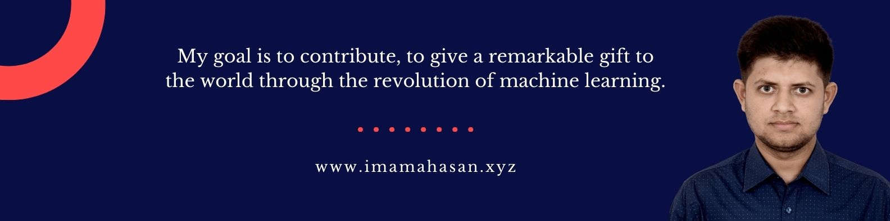
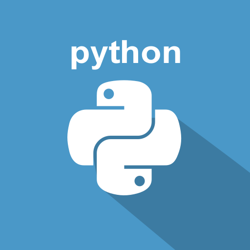

<h1> 👋 Hello, I'm Imam Ahasan </h1>

A Front-End Developer  
🏠 &nbsp; Living: Dhaka, Bangladesh 
 

### Useful Links

 
 

 
 

### 👨‍🏫 &nbsp; About Me

  To make a remarkable gift for the universe to contribute to the revolution of World Wide Web.

### 👨🏽‍💻 &nbsp; My Skills

 
 
 

  

  
 

### Thank you for viewing my portfolio.  
All rights reserved by Imam Ahasan &copy; 2022
